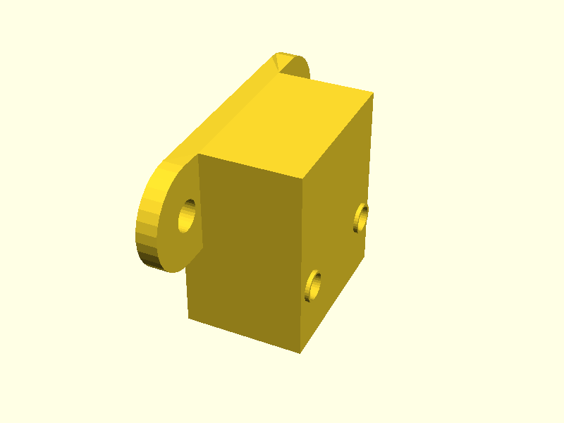
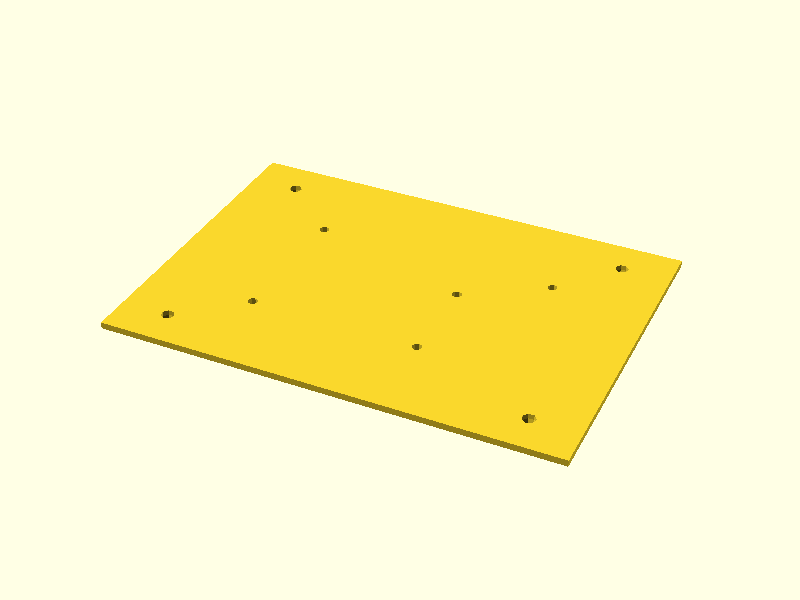
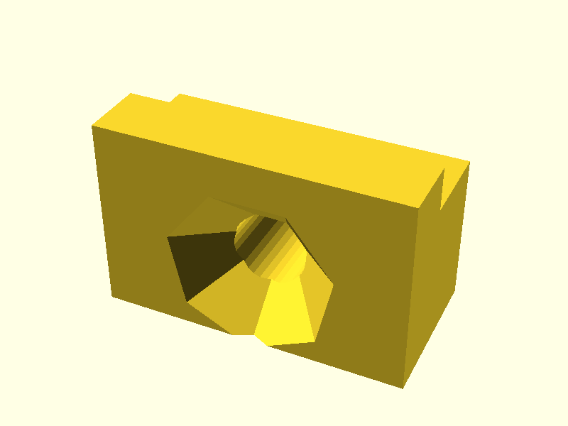
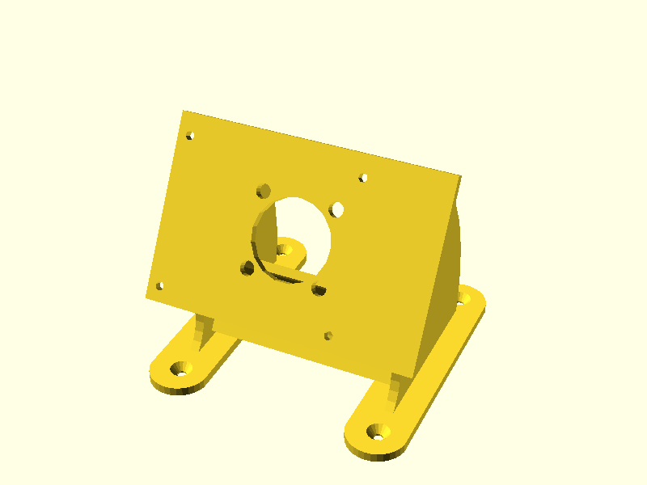
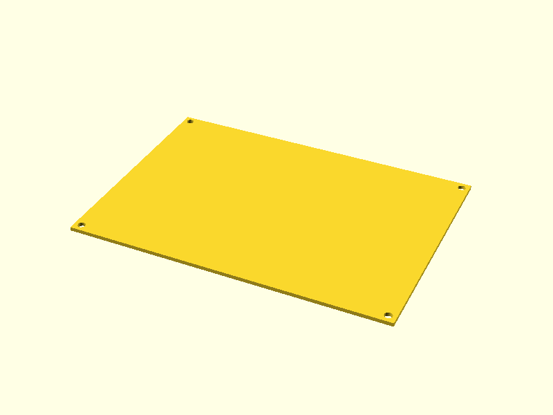
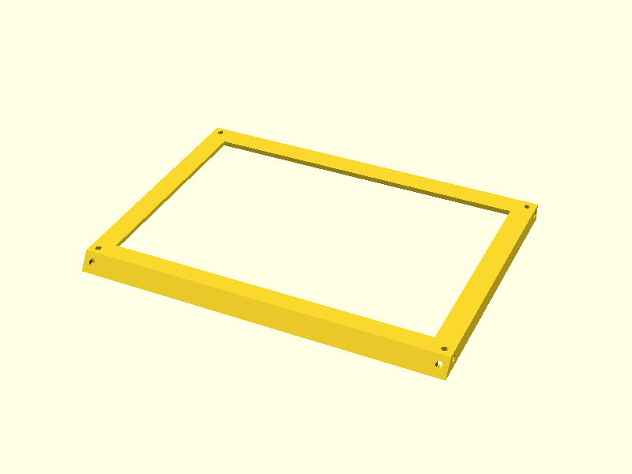

# Исследование современного состояния проблемы

## Oценкa современного состояния и перспективных направлений в области лингвистических моделей, применяемых в медицинских и диагностических экспертных системах

## Моделирование экспресс-анализатора на антигены семейства коронавирусов

# Разработка технических заданий

## Подготовка частного технического задания на механическую часть экспресс-анализатора на антигены семейства коронавирусов

## Составление технического задания на создание прототипа демонстратора технологии

## Создание частного технического задания на программную часть прототипа демонстратора технологии

## Составление технического задания на разработку системы технического зрения экспресс-анализатора.     

# Приобретение оборудования

В качестве микроконтроллера для управления мехатроникой
прототипа-демонстратора технологии экспресс-анализатора антигенов
коронавируса была приобретена плата Arduino Mega 2560 по цене 6030,0 рублей.
Микрокомпьютер Raspberry Pi 4 Model B 8GB по цене 24000,0 рублей был
приобретен в качестве микрокомпьютера для решения задач компьютерного зрения
прототипа-демонстратора технологии экспресс-анализатора антигенов
коронавируса. Карта памяти Transcend 128GB microSD была приобретена за 5918,0
рублей в качестве дискового накопителя для микрокомпьютера, используемого для
хранения и работы операционной системы и системных программ.

Камера A4Tech Web A4Tech по цене 4950,0 рублей приобретена в качестве
видеокамеры для решения задач технического зрения прототипа-демонстратора
технологии экспресс-анализатора антигенов коронавирусов. USB-разветвитель
приобретен по цене 550,0 рублей в качестве разветвителя последовательного
интерфейса для подключения периферийных устройств. Для хранения данных
прототипа-демонстратора технологии экспресс-анализатора коронавирусных
антигенов приобретен жесткий диск SATA объемом 120 Гб 2,5" по цене 1860,0
рублей. Приобретен внешний 2,5" бокс для хранения данных (поз. 6) для
подключения к микрокомпьютеру (поз. 2) по цене 730,0 рублей. 

Вентилятор 40x40x10 мм, 12 В по цене 990,0 руб. приобретен в качестве
устройства для охлаждения корпуса прототипа-демонстратора технологии
экспресс-анализатора антигенов коронавирусов. Приобретена плата управления
для 3D-принтера 1.4 RAMPS по цене 898,0 рублей в качестве платы для
подключения драйверов управления шаговыми двигателями и других мехатронных
устройств прототипа-демонстратора технологии экспресс-анализатора антигенов
коронавирусов. Драйвер шагового двигателя A4988 с радиатором был приобретен в
качестве микросхемы управления маломощным шаговым двигателем (поз. 23) по
цене 1390,0 руб.

Для предотвращения выхода рабочего органа за границы рабочей зоны был
приобретен концевой выключатель Mechanical EndStop по цене 590,0 руб. В
качестве аналоговой микросхемы для считывания тока в цепи управления
прототипа-демонстратора технологии экспресс-анализатора антигенов
коронавируса приобретен датчик тока 5А по цене 1990,0 рублей. Для перемещения
органа управления по направляющему валу была приобретена каретка с
линейным подшипником SCS8LUU  по цене 1494,0 рублей.  Вал гладкий
(направляющий) 8мм, 600мм по цене 3030,0 руб. приобретены для создания
конструкции подвижной рабочей зоны прототипа-демонстратора технологии
экспресс-анализатора на антигены семейства коронавирусов. TR8 гайка без люфта
по цене 895.0 руб. THSL-600-8D вал винтовой с гайкой, 600мм по цене 9735.0
руб. SK8 держатель вала по цене 495.0 руб. опорный подшипник фланца KP08
(8мм.) цена 447.0 руб. муфта для переключения с оси 5мм на ось 8мм по цене
1032.0 руб. Каретка с линейным подшипником SCS8UU по цене 338.0 руб.

DC-DC понижающий преобразователь напряжения LM2596 приобретен по цене 1428,0
руб. в качестве электрического устройства для преобразования электрической
энергии в электрической цепи прототипа-демонстратора технологии
экспресс-анализатора семейства антигенов. Шаговый двигатель 17HS4401
nema17 приобретен в качестве маломощного исполнительного механизма по цене
6490,0 руб. Кронштейн-уголок для Nema 17 был приобретен в качестве опорной
конструкции для крепления исполнительного устройства малой мощности (поз. 23)
по цене 300,0 руб.

Для аддитивной печати конструктивных элементов прототипа-демонстратора
технологии экспресс-анализатора антигенов семейства коронавирусов приобретен
пластик PETG Black по цене 5750,0 рублей. Для изготовления элементов
конструкции прототипа-демонстратора технологии экспресс-анализатора антигенов
коронавирусов был приобретен конструкционный алюминиевый профиль (1 метр) по
цене 16400,0 рублей. Шаговый двигатель Nema 34, 86HS115-6004 по цене 14398,0
руб. Приобретен драйвер шагового двигателя TB6600 с радиатором по цене 6392.0
руб. в качестве микросхемы управления исполнительным устройством большой
мощности. 

Блок питания 12v 12.5A приобретен по цене 7500.0 руб. в качестве источника
питания прототипа-демонстратора технологии экспресс-анализатора антигенов
коронавируса. Сервопривод MG996R был приобретен за 3990,0 руб. в качестве
сервоустройства для перемещения рабочего органа вокруг своей оси. Моноблок
27" Acer Aspire был приобретен по цене 65000,0 руб. для использования в 
качестве терминального устройства управления экспресс-анализатором.

# Cоставление правил экспертной системы

## Подготовка текстового описания правил экспертной системы 

## Написание алгоритмов экспресс-анализа на антигены семейства коронавирусов

## Составление правил экспертной системы прототипа-демонстратор экспресс-анализатора на антигены семейства короновирусов.

## Разработка критериев для системы распознавания образов.  

# Разработка оптической схемы системы технического зрения

## Разработка технологии технического зрения прототипа

## Разработка оптической схемы прототипа экспресс-анализатора

# Разработка чертежей габаритного, сборочного и общего вида

## Создание габаритного чертежа прототипа  экспресс-анализатора

## Подготовка сборочного чертежа прототипа экспресс-анализатора. 

## Создание чертежа общего вида прототипа демонстратора технологии

# Пуско-наладочные работы поставленного оборудования 

# Aддитивная печать элементов конструкции устройства

## Разработка моделей и аддитивная печать элементов конструкции.

Была разработана модель основной крышки корпуса показанная на рисунке. 

Была создана модель платы корпуса драйвера показанная на рисунке. 

Была разработана модель левого и правого разъема крышки главного корпуса показанная на рисунке. 

Была создана модель основного корпуса показанная на рисунке. 

Подготовлена модель крышки корпуса драйверов показанная на рисунке. 

Подготовлена модель крышки камеры показанная на рисунке. 

При помощи среды моделирования Blender подготовлена модель торцевого упора y показанная на рисунке. 

Была создана модель стойки основного корпуса raspberry pi показанная на рисунке. 

При помощи среды моделирования Blender подготовлена модель разъема основного корпуса показанная на рисунке. 

модель правой части основного корпуса  показанная на рисунке. 

При помощи среды моделирования Blender подготовлена модель задней части основного корпуса показанная на рисунке. 

При помощи среды моделирования Blender подготовлена модель верхней части основного корпуса  показанная на рисунке. 

Была создана модель основного корпуса верхний левый правый угол показанная на рисунке. 

Разработана модель держателя лазерного датчика показанная на рисунке. 

модель держателя камеры показанная на рисунке. 

При помощи среды моделирования Blender подготовлена модель верхнего разъема основного корпуса показанная на рисунке. 

Разработана модель держателя блока питания показанная на рисунке. 

модель дистанционной шайбы показанная на рисунке. 

При помощи среды моделирования Blender подготовлена модель торцевого упора оси z показанная на рисунке. 

Была разработана модель торцевого упора оси x показанная на рисунке. 

